# dsh-plugins · DSH 插件集合

<p align="center">
  
</p>

<p align="center">
  
  &nbsp;
  
</p>

<p align="center">
  <strong>DeepSeek Harness（DSH）插件集合 · 每个插件独立成包，按需安装</strong><br>
  <em>工作台 · 桌宠 · 费用统计 · 视觉适配 · 桌面端 · 梁神模式 · 皮肤中心 · SSH 运维</em>
</p>

<div align="center">

[是什么](#是什么) · [功能插件](#功能插件) · [快速开始](#快速开始) · [常见问题](#常见问题) · [已知限制](#已知限制) · [贡献](#贡献) · [许可](#许可)

</div>

## 是什么

dsh-plugins 是一个可搜寻、可按需安装的 DeepSeek Harness（DSH）插件集合。仓库里的每个插件都保持自包含：有自己的 README、配置与许可说明，可以单独安装、单独使用，也可以组合成一个更完整的 DSH 工作台。

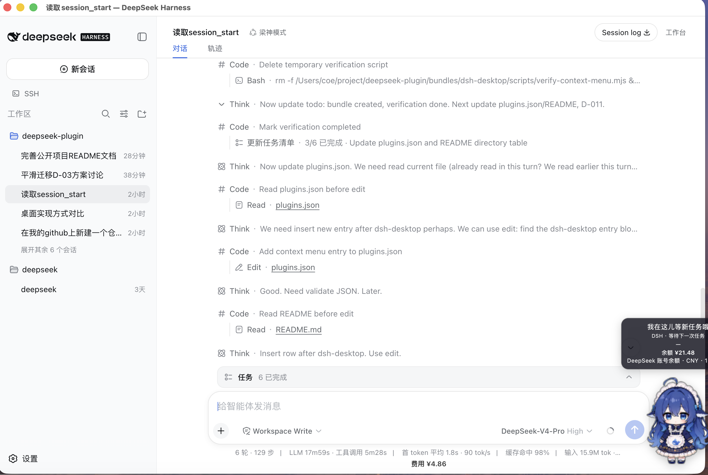

| 能力 | 原生 dsh web | 本仓库收录的插件 |
| --- | --- | --- |
| 右侧工作台 | 无 | [dsh-workbench](#dsh-workbench)：文件浏览 / 编辑 / 预览 + 内嵌浏览器 + Git 面板 |
| 桌面宠物 | 无 | [dsh-dafeiyu-mac](#dsh-dafeiyu-mac)：由 DSH 会话状态驱动的 macOS 桌宠 |
| 费用统计 | 无 | [dsh-deepseek-cost](#dsh-deepseek-cost)：按 DeepSeek 官方定价统计 token 用量与费用 |
| 视觉理解 | 无 | [dsh-vision-adapter](#dsh-vision-adapter)：给纯文本主模型按需调用多模态端点 |
| 桌面端 | 官方 / 社区方案 | [dsh-desktop](#dsh-desktop--dsh-desktop-context-menu)：Electron 桌面壳 + 原生右键菜单 |
| Agent 预设 | 官方预设 | 梁神模式：面向 V4 Pro 的两阶段锚定预设（外部） |
| SSH 运维 | 无 | dsh-ssh：主机管理 / Web 终端 / SFTP / 隧道 / 集群（外部） |
| 主题皮肤 | 默认主题 | dsh-skins：皮肤中心 + 多款内置皮肤（外部） |

## 功能插件

### dsh-workbench

DSH Web GUI 右侧工作台：**文件浏览 / 编辑 / 预览 + 内嵌浏览器 + Git 面板**，VS Code 式布局。入口在会话头部「工作台」按钮，右侧列占用 shell details 布局列，对话区自动收缩、不遮挡聊天。

| 文件与编辑器 | Git 面板 |
| --- | --- |
| 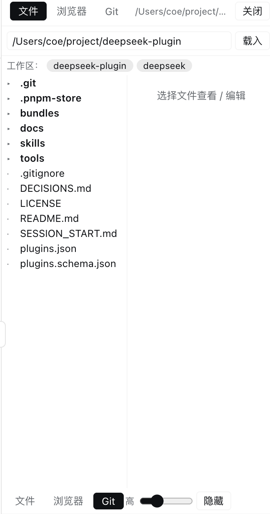 | 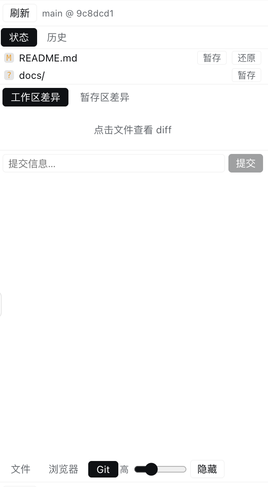 |

安装：

```sh
dsh plugin --profile <name> add "Siq5005/dsh-plugins#path:/bundles/dsh-workbench"
```

详见 [dsh-workbench README](bundles/dsh-workbench/README.md)。

### dsh-dafeiyu-mac

macOS 桌面大肥鱼：由 DSH 真实会话状态驱动的桌宠伴侣。透明置顶窗口显示当前项目、阶段与待办进度，思考 / 工作 / 等待确认 / 出错等状态都有对应动作与文案；可选联动 dsh-deepseek-cost 显示 DeepSeek 账号余额。

| 桌宠状态气泡 | 设置卡片 |
| --- | --- |
|  | 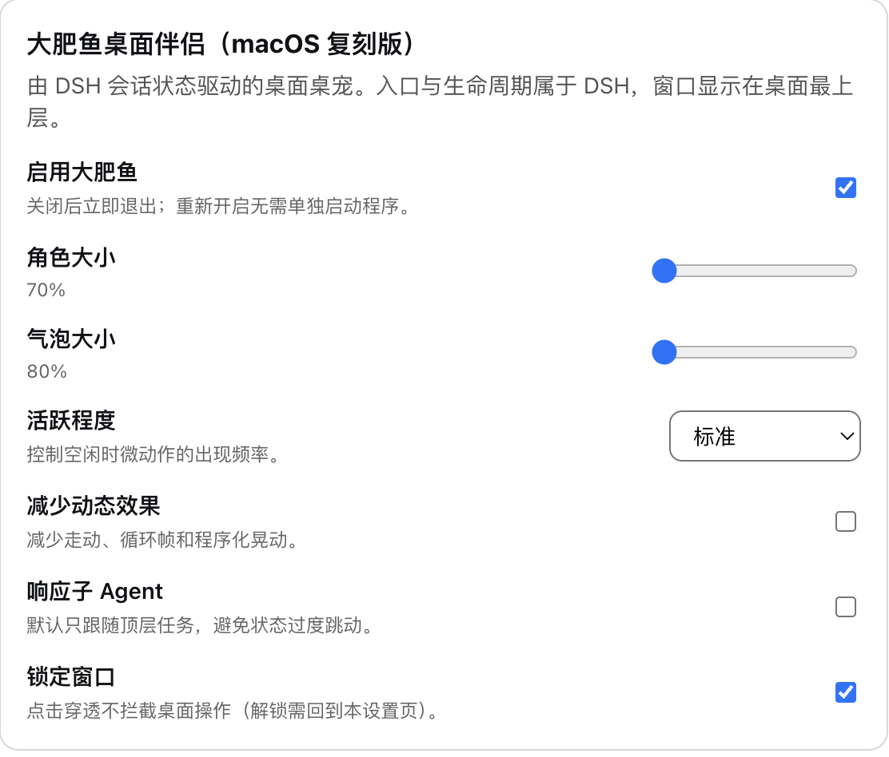 |

安装：

```sh
dsh plugin --profile <name> add "Siq5005/dsh-plugins#path:/bundles/dsh-dafeiyu-mac"
```

> macOS arm64 开箱即用；其他平台需要 Python 3.11+ 与 PySide6，或运行构建脚本生成 helper。详见 [dsh-dafeiyu-mac README](bundles/dsh-dafeiyu-mac/README.md)。

### dsh-deepseek-cost

按 DeepSeek 官方定价统计当前对话的 token 用量与累计费用，在聊天输入框下方的统计行旁实时显示；支持高峰 / 空闲分时计价、按模型计价、会话投影持久化，并可查询当前 API Key 的账号余额。

| 费用展示 | 设置页 |
| --- | --- |
|  | 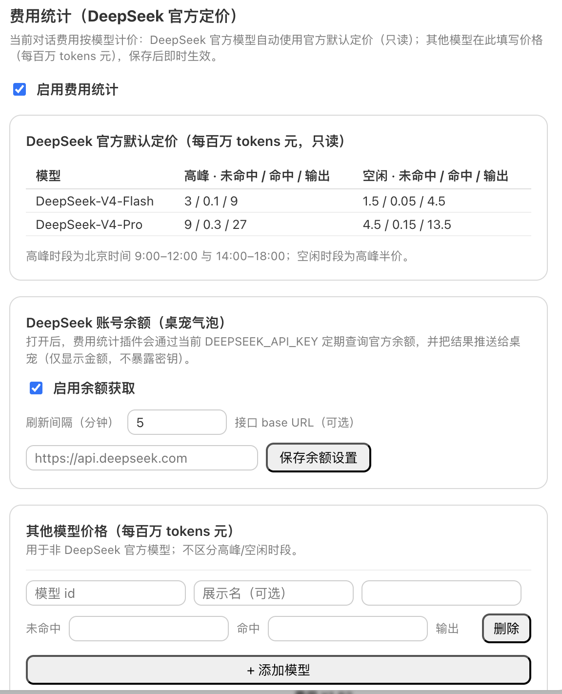 |

安装：

```sh
dsh plugin --profile <name> add "Siq5005/dsh-plugins#path:/bundles/dsh-deepseek-cost"
```

详见 [dsh-deepseek-cost README](bundles/dsh-deepseek-cost/README.md)。

### dsh-vision-adapter

给 DeepSeek 纯文本主模型加“眼睛”：图片在 adapter 层改写为文本，`analyze_image` 工具按需调用你配置的 OpenAI 兼容多模态端点，文字答案回到主模型继续推理。支持内容哈希缓存、失败语义明确的降级。

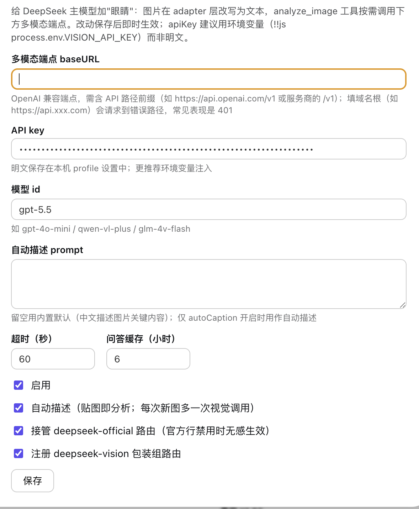

安装：

```sh
dsh plugin --profile <name> add "Siq5005/dsh-plugins#path:/bundles/dsh-vision-adapter"
```

> 多模态调用消耗你自己的第三方 API 额度。详见 [dsh-vision-adapter README](bundles/dsh-vision-adapter/README.md)。

### dsh-desktop & dsh-desktop-context-menu

- [dsh-desktop](https://github.com/Siq5005/dsh-desktop)：把 Electron 桌面壳做成 DSH bundle（desktop-as-plugin），提供托盘、多 profile 切换与 DMG 打包。
- [dsh-desktop-context-menu](bundles/dsh-desktop-context-menu/)：给 DSH Desktop 窗口加原生右键菜单（复制 / 粘贴 / 剪切 / 全选 / 后退 / 前进），Host-only，普通 Web profile 自动 no-op。

| 桌面客户端 | 原生右键菜单 |
| --- | --- |
| 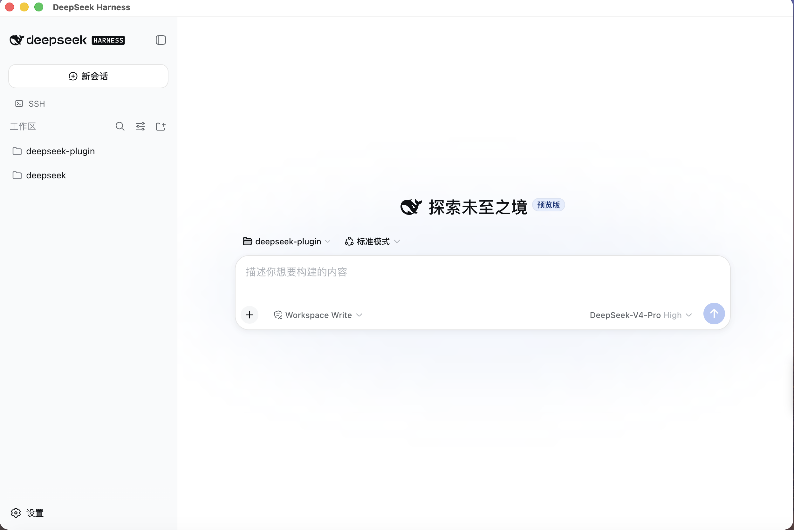 | 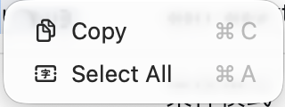 |

安装右键菜单：

```sh
dsh plugin --profile <name> add "Siq5005/dsh-plugins#path:/bundles/dsh-desktop-context-menu"
```

### 外部插件

以下插件由 [zhu1090093659/dsh-web-ui](https://github.com/zhu1090093659/dsh-web-ui) 等上游项目发布，本仓库仅收录索引，不托管代码。

| 插件 | 说明 | 截图 |
| --- | --- | --- |
| `@linxin666/dsh-liangshen` | 梁神模式：两阶段锚定 agent 预设 | 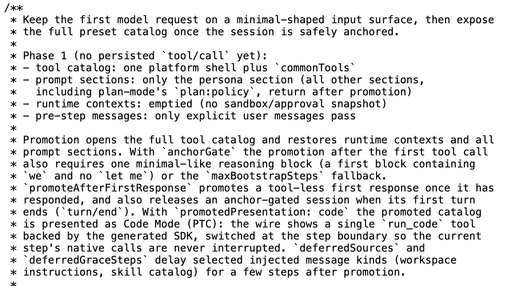 |
| `@linxin666/dsh-skins` | 皮肤中心 + 多款内置皮肤 | 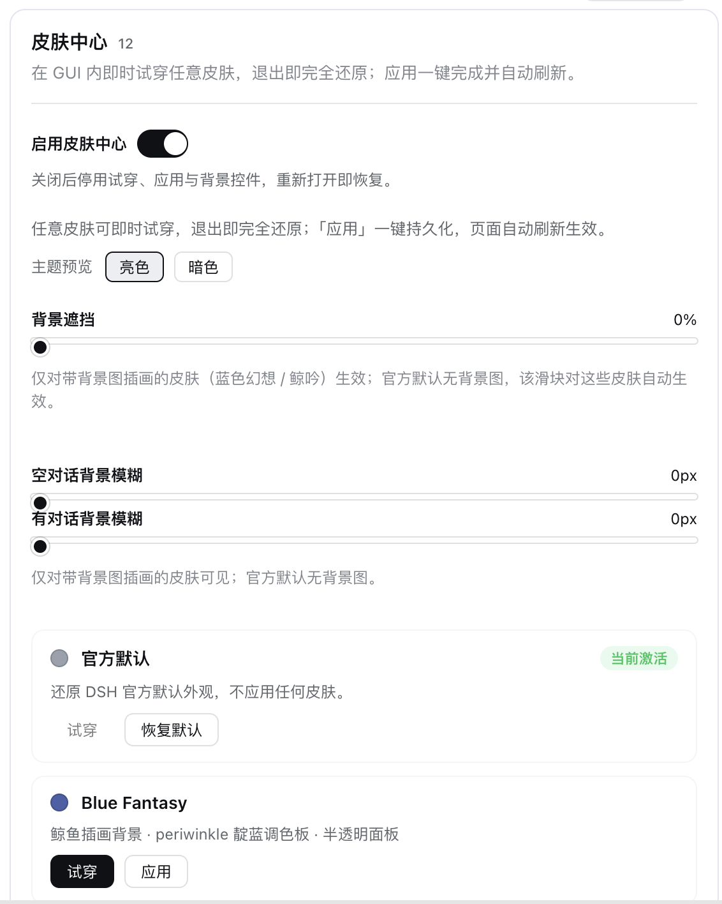 |
| `@linxin666/dsh-ssh` | SSH 运维：主机管理 / Web 终端 / SFTP / 隧道 / 集群 | 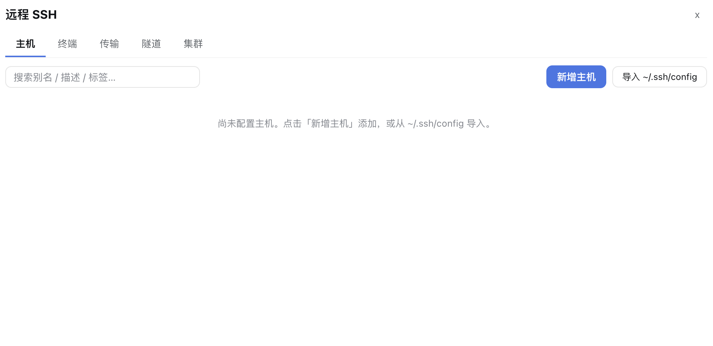 |

安装：

```sh
dsh plugin --profile <name> add @linxin666/dsh-liangshen
dsh plugin --profile <name> add @linxin666/dsh-skins
dsh plugin --profile <name> add @linxin666/dsh-ssh
```

> `dsh-skins` 的皮肤中心通常还需安装 `@linxin666/dsh-client-ui-web-ui-settings`。

## 快速开始

### 环境要求

- 已安装 DeepSeek Harness，`dsh web` 可正常启动。
- Node.js 20+（各插件包均要求 Node 20+）。
- 仅 `dsh-dafeiyu-mac` 额外要求 macOS arm64 开箱即用；其他平台见其 README。

### 安装单个插件（推荐）

`dsh plugin add` 会转发给 pnpm，可从 git 仓库只安装目标子目录，无需克隆整个仓库：

```sh
dsh plugin --profile <name> add "Siq5005/dsh-plugins#path:/bundles/<plugin-name>"
```

例如安装工作台：

```sh
dsh plugin --profile <name> add "Siq5005/dsh-plugins#path:/bundles/dsh-workbench"
```

### 从本仓库安装

```sh
git clone https://github.com/Siq5005/dsh-plugins.git
cd dsh-plugins
dsh plugin --profile <name> add ./bundles/<plugin-name>
```

### 验证与卸载

安装后重启 `dsh web`，对应入口或配置页出现即生效；也可以用 `dsh --profile <name> --dump-config` 确认插件配置层已挂载。

卸载：

```sh
dsh plugin --profile <name> remove <plugin-name>
```

## 常见问题

<details>
<summary><strong>装完重启了，为什么侧边栏 / 界面没有新入口？</strong></summary>

先确认插件装进了目标 profile（命令里的 `--profile <name>`），再用 `dsh --profile <name> --dump-config` 确认插件配置层已挂载。注意页面刷新不够，要重启 `dsh web` 进程。

</details>

<details>
<summary><strong>工作台为什么替换了内置的「工具调用详情」面板？</strong></summary>

dsh-workbench 采用 VS Code 式右侧布局，占用 shell 的 details 布局列。这是右侧工作台与内置工具调用详情面板的取舍；需要工具调用详情时可关闭工作台或切换布局。

</details>

<details>
<summary><strong>桌宠装了没反应？</strong></summary>

`dsh-dafeiyu-mac` 内置的 helper 是 darwin-arm64 单文件；在 Intel Mac 或其他平台需要 Python 3.11+ 与 PySide6，或运行 `bash scripts/build-helper.sh` 自行构建。详见其 README。

</details>

<details>
<summary><strong>视觉插件会消耗哪里的额度？</strong></summary>

`dsh-vision-adapter` 只把图片字节发给你在配置里填写的第三方 OpenAI 兼容多模态端点，消耗的是该第三方服务的 API 额度；请自行确认端点与隐私策略。

</details>

<details>
<summary><strong>费用统计和 DeepSeek 官方账单不完全一致？</strong></summary>

费用统计按内置的 DeepSeek 官方定价快照估算，供会话内参考；官方调价后需更新插件内的定价快照。账号余额查询默认关闭，需在设置页显式开启。

</details>

## 已知限制

- `dsh-workbench` 无文件 watcher，需手动刷新；Git 面板暂不支持 push / pull / fetch。
- `dsh-dafeiyu-mac` 内置 helper 仅 darwin-arm64；onefile 首启解压约 5–8 秒。
- `dsh-deepseek-cost` 只统计当前会话；官方模型定价为代码快照，官方调价需更新代码。
- `dsh-vision-adapter` 的图片描述记忆与问答缓存为会话内内存缓存，重启清空。
- `dsh-desktop-context-menu` 仅在 DSH Desktop 的 Electron 主进程生效，普通 Web profile 自动 no-op。
- 外部 npm 插件（梁神模式 / 皮肤中心 / SSH）的维护与已知问题以 [dsh-web-ui](https://github.com/zhu1090093659/dsh-web-ui) 项目为准。

## 贡献

1. 在对应目录下创建插件，可参考 [`bundles/hello-plugin`](bundles/hello-plugin/)；
2. 本地验证安装与功能；
3. 更新 [`plugins.json`](plugins.json) 与上方插件目录；
4. 提交 Pull Request。

提交前请确认：

- 插件目录自包含，并附有 README；
- 索引字段与 [`plugins.schema.json`](plugins.schema.json) 一致；
- 引用了第三方代码或素材时，保留相应许可说明。

## 许可

本仓库整体采用 [MIT License](LICENSE)。各插件目录内另有说明的，以目录内说明为准。

- 插件代码：MIT（目录内另有声明的除外）。
- `dsh-dafeiyu-mac` 的视觉素材：采用 [CC BY-SA 4.0](https://creativecommons.org/licenses/by-sa/4.0/) 许可，详见 [`ASSET_LICENSE.md`](bundles/dsh-dafeiyu-mac/ASSET_LICENSE.md)。

索引中列出的外部 npm 插件由各自项目负责许可与维护。
